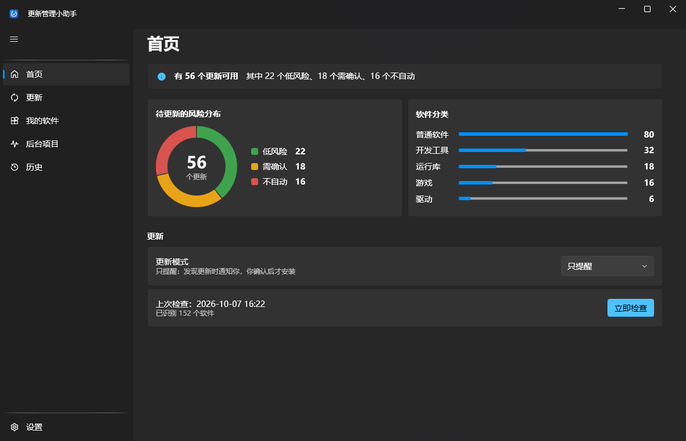
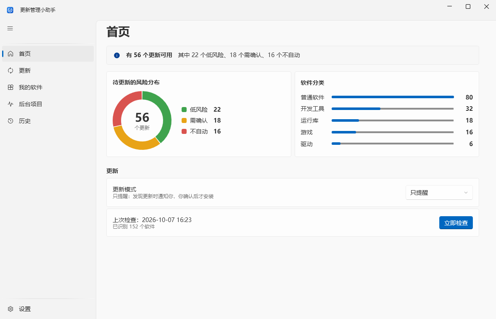
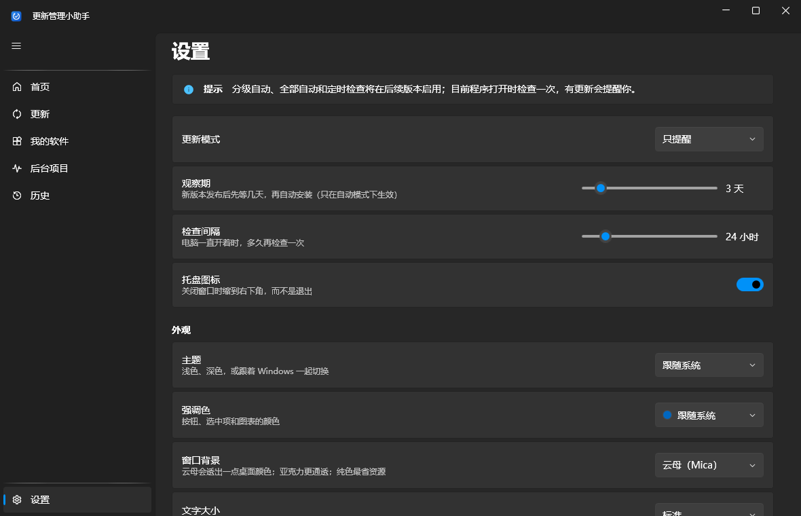

<p align="center">
  
</p>

<h1 align="center">更新管理小助手</h1>

<p align="center">
  纯净、无广告、懂国产软件、把"稳"放第一位的 Windows 软件更新管家
</p>

<p align="center">
  <a href="https://github.com/chen-pi-2007/Manage-automatic-computer-updates/releases/latest">下载最新版</a> ·
  <a href="CHANGELOG.md">更新记录</a> ·
  <a href="docs/superpowers/specs/2026-09-30-update-helper-design.md">设计文档</a>
</p>

---

电脑不像手机有统一的应用商店：软件大多从浏览器下载，各自弹窗提示更新，国产软件没人统一管，也不知道哪个更新该装、哪个装了会出问题。各家"电脑管家"又常常带广告和捆绑。

更新管理小助手只做一件事并把它做好：**看清电脑里装了什么，替你判断哪些更新可以放心装，然后安静地装好。**



## 特点

- **纯净**：没有广告，没有捆绑，不推荐你装任何东西
- **看得全**：深度扫描注册表、隐藏组件、服务、开机自启和计划任务，归到所属软件下面，每一项都用一句话说明它是干什么的
- **懂国产软件**：在 winget 软件库之外，用 GKD 式的 YAML 规则补上 WPS、迅雷、火绒等 winget 认不出的软件
- **替你判断风险**：每个更新分成低风险 / 需确认 / 不自动 / 不管四档；大版本跨越、识别存疑、多版本共存的运行库都不会被自动安装
- **装得安全**：winget 安装包核对指纹；规则下载的安装包必须通过数字签名校验，签名者要和规则里写的发布者一致
- **不打扰**：常驻托盘，发现更新时弹一条通知，点一下直接打开更新页

## 下载

到 [Releases](https://github.com/chen-pi-2007/Manage-automatic-computer-updates/releases/latest) 下载：

| 文件 | 大小 | 说明 |
|---|---|---|
| `UpdateHelper-版本号-win-x64-portable.zip` | 约 80 MB | **推荐**：解压即用，不用装别的 |
| `UpdateHelper-版本号-win-x64-needs-dotnet10.zip` | 约 10 MB | 体积小，需要先安装 [.NET 10 桌面运行时](https://dotnet.microsoft.com/download/dotnet/10.0) |

解压后双击 `UpdateHelper.exe`。

**系统要求**：Windows 10 1809 或更新版本（64 位），系统里有 winget（Windows 11 自带；Windows 10 可在微软商店安装"应用安装程序"）。

> 目前程序没有数字签名，第一次打开时 Windows 可能提示"已保护你的电脑"，点"更多信息 → 仍要运行"即可。

## 功能

| 页面 | 能做什么 |
|---|---|
| 首页 | 有多少更新、风险分布环形图、软件分类统计、一键检查 |
| 更新 | 勾选后一键更新，安装前确认；一个失败不影响其他 |
| 我的软件 | 所有软件和它们的图标、版本、发布者、安装位置，可搜索；游戏、运行库、驱动默认收起 |
| 后台项目 | 服务、开机自启、计划任务，标出归属软件和用途 |
| 历史 | 每次更新的结果和原因 |
| 设置 | 更新模式、观察期、检查间隔、托盘；主题、强调色、窗口背景、文字大小、紧凑模式 |

<table>
  <tr>
    <td></td>
    <td></td>
  </tr>
  <tr>
    <td align="center">浅色主题</td>
    <td align="center">设置</td>
  </tr>
</table>

## 路线图

| 状态 | 内容 |
|---|---|
| ✅ 0.1.0 | 深度扫描、风险判断、手动更新、规则补充库、主窗口 + 托盘 + 通知、外观设置 |
| ✅ 0.2.0 | 标准 Windows 通知（请勿打扰也进通知中心）、定时检查、开机自动启动、观察期记录 |
| ✅ 0.3.0 | 查看残留（只读预览，按归属分类、系统目录白名单保护）、残留规则格式 |
| 🚧 下一步 | 后台助手（安装时授权一次，以后不再弹 UAC）、残留的删除 + 备份恢复、分级自动 / 全部自动的静默安装 |
| 📋 之后 | Windows 更新控制（暂停任意时长、停在当前大版本、不自动重启、不换驱动） |
| 📋 之后 | Geek 式卸载：先跑软件自带卸载程序，再列出残留表格让你勾选，删除前全部备份可恢复 |
| 📋 之后 | 安全页（调用 Defender）、规则订阅页、官方规则仓库 |
| 💭 第二期 | 应用商店、换机一键装回、保留数据的版本回退 |

详细设计见 [设计文档](docs/superpowers/specs/2026-09-30-update-helper-design.md)。

## 从源码编译

需要 [.NET 10 SDK](https://dotnet.microsoft.com/download/dotnet/10.0) 和 Windows。

```powershell
git clone https://github.com/chen-pi-2007/Manage-automatic-computer-updates.git
cd Manage-automatic-computer-updates
dotnet test                                   # 跑全部测试
dotnet run --project src/UpdateHelper.App     # 启动主程序
```

命令行版（不开窗口，适合排查问题）：

```powershell
dotnet run --project src/UpdateHelper.ScanCli -- --updates    # 列出可用更新
dotnet run --project src/UpdateHelper.ScanCli -- --all        # 扫描结果，含隐藏组件
```

发布便携版：

```powershell
dotnet publish src/UpdateHelper.App -c Release -r win-x64 --self-contained true -o publish
```

## 项目结构

```
src/
  UpdateHelper.Core          扫描、归组分类、规则、风险判断、安装与安全校验（不依赖界面）
  UpdateHelper.Winget        通过 winget 官方 COM 接口查更新、装更新
  UpdateHelper.Presentation  界面逻辑（ViewModel），不依赖 WPF，可单独测试
  UpdateHelper.App           WPF 主程序 + 托盘（WPF-UI）
  UpdateHelper.ScanCli       命令行工具
rules/                       官方规则（每个软件一个 YAML），写法见 rules/README.md
tests/                       单元测试
learning/python/             每个核心模块对应的 Python 简化版，带详细中文注释，用来学习原理
docs/                        设计文档和分期实施计划
tools/                       开发用脚本（生成图标、截图核对界面）
```

## 参与贡献

最欢迎的贡献是**规则**：如果某个软件没被认出来、风险判断不对，或者后台项目缺少说明，可以照 [rules/README.md](rules/README.md) 写一个 YAML 文件提交 Pull Request。

发现问题请提 [Issue](https://github.com/chen-pi-2007/Manage-automatic-computer-updates/issues)，附上软件名、版本和你看到的现象。

## 许可证

[GPL-3.0](LICENSE)。可以自由使用、修改和分发；修改后再发布的版本也必须以 GPL-3.0 开源——这样就不会出现拿本项目代码加广告、捆绑后闭源售卖的版本。
